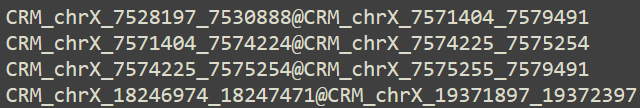
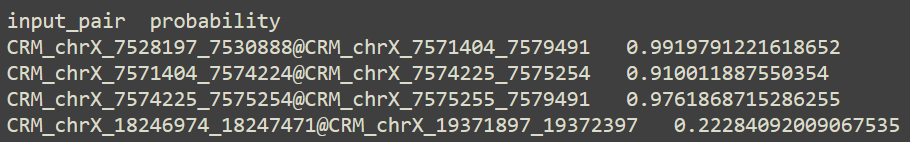

# CRMIPred (CRM Interaction Predictor)


## Related paper:
Yu-Huai Yu+, Wei-Cheng Dai+, Zhi-Hao Jiang+ and Tzu-Hsien Yang* "CRMIPred: identifying the spatial interactions among Drosophila cis-regulatory modules via considering their cross-attended epigenetic profiles", (submitting).

+: These authors contributed equally.

## Prepare the Environment

Suggested running environments: Linux Ubuntu 16.04.6, Python 3.8.13

We recommend that you can use the conda package to create a new environment. This will automatically install the required python packages. 

Here is an example: 

1. Install the Conda package for you system. The installation of the package can be found <a href="https://docs.conda.io/projects/conda/en/latest/user-guide/install/index.html">here</a>. 

2. Create the CRMIPred Conda environment. This may take a while, depending on the network status.

```
conda create -n "CRMIPred" python=3.8.13
```

3. Activate your CRMIPred Conda environment. 

```
conda activate CRMIPred
```

## Steps to Use CRMIPred

1. Download the codes from the following link and unzip the file. Please skip it if you have done this step.

```
wget https://cobis-fs.bme.ncku.edu.tw/CRMIPred/CRMIPred.tar.gz
```

2. Unzip the file.

```
tar -zxvf CRMIPred.tar.gz
```

3. Change the working directory.

```
cd CRMIPred
```

4. Download the processed epigenetic datasets from the following link.

```
wget https://cobis-fs.bme.ncku.edu.tw/CRMIPred/Data.tar.gz
```

5. Unzip the file.

```
tar -zxvf CRMIPred_Dataset.tar.gz
```

6. If this is the first time you use CRMIPred, run the following command to install necessary packages. 

```
pip install -r requirements.txt
```

CRMIPred can also support GPU acceleration. If you want to utilize GPU, please run the following command instead:

```
pip install -r requirements_gpu.txt
```


7. Prepare the input Drosophila CRM region pairs (ver. dm6).
     
   The input CRM pair format **MUST** followed the following formats:
   
`CRM_[chromosome]_[start1]_[end1]@CRM_[chromosome]_[start2]_[end2]`
   
   **Important Rule:** The start position of the first CRM must be smaller than the start position of the second CRM (`start1 < start2`).
   
   For example: (as the input file named input_Test.csv) 
   
   
   
   Note: The input chromosomal regions start from the 5' end.

8. Predict the probability if the given CRM pairs are interacting pairs.

```
python main.py -i <input_txt_file> -o <output_file_name> -mode <normal|reduced>
```

>**Required arguments:**
>
>* -i: The input file for CRMIPred.
>
>* -o: The output prediction results.
>
>**Optional arguments:**
>
>* -mode: 'normal' (default model) or 'reduced' (reduced version model).

## Output Results
If we use the following as our inputs with the example command:



```
python main.py -i input_test.txt -o output_test
```

>** output_test:**



Output format explanation:
>* CRM1@CRM2 [interacting probability].

