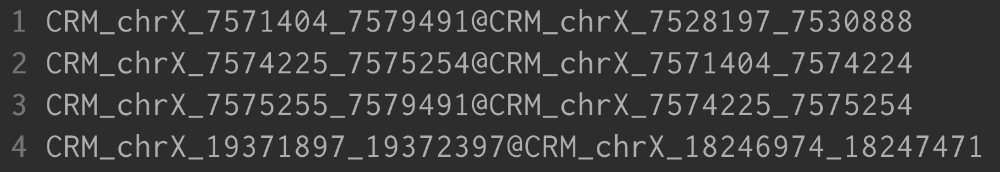
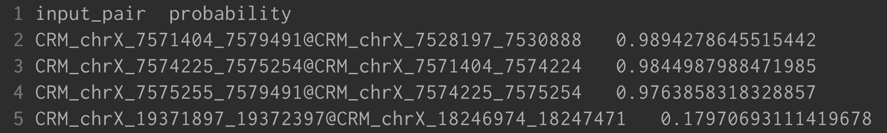

# ACIP (Attention-based CRM Interaction Predictor)


## Related paper:
Yu-Huai Yu+, You-An Kuo+, He-Ruei Lee, and Tzu-Hsien Yang* "ACIP: identifying spatial interactions among Drosophila cis-regulatory modules via considering their cross-attended epigenetic profiles", (submitting).

+: These authors contributed equally.

## Prepare the Environment

Suggested running environments: Linux Ubuntu 16.04.6, Python 3.8.13

We recommend that you can use the conda package to create a new environment. This will automatically install the required python packages. 

Here is an example: 

1. Install the Conda package for you system. The installation of the package can be found <a href="https://docs.conda.io/projects/conda/en/latest/user-guide/install/index.html">here</a>. 

2. Create the ACIP Conda environment. This may take a while, depending on the network status.

```
conda create -n "ACIP" python=3.8.13
```

3. Activate your ACIP Conda environment. 

```
conda activate ACIP
```

## Steps to Use ACIP

1. Download the codes from the following link and unzip the file. Please skip it if you have done this step.

```
wget https://cobis-fs.bme.ncku.edu.tw/ACIP/ACIP.tar.gz
```

2. Unzip the file.

```
tar -zxvf ACIP.tar.gz
```

3. Change the working directory.

```
cd ACIP
```

4. Download the processed epigenetic datasets from the following link.

```
wget https://cobis-fs.bme.ncku.edu.tw/ACIP/ACIP_Dataset.tar.gz
```

5. Unzip the file.

```
tar -zxvf ACIP_Dataset.tar.gz
```

6. If this is the first time you use ACIP, run the following command to install necessary packages. 

```
pip install -r requirements.txt
```

ACIP can also support GPU acceleration. If you want to utilize GPU, please run the following command instead:

```
pip install -r requirements_gpu.txt
```


7. Prepare the input Drosophila CRM region pairs (ver. dm6).
     
   The input CRM pair format **SHOULD** followed the following formats:
   
   CRM\_[chromosome]\_[start]\_[end]@CRM\_[chromosome]\_[start]\_[end]
   
   For example: (as the input file named input_Test.csv) 
   
   
   
   Note: The input chromosomal regions start from the 5' end.

8. Predict the probability if the given CRM pairs are interacting pairs.

```
python main.py -i <input_txt_file> -o <output_file_name>
```
>**Required arguments:**
>
>* -i: The input file for ACIP.
>
>* -o: The output prediction results.


## Output Results
If we use the following as our inputs with the example command:



```
python main.py -i input_test.txt -o output_test
```

>** output_test:**



Output format explanation:
>* CRM1@CRM2 [interacting probability].

